<div align="center">

# MCPocket

**在手机上运行 MCP Server**

无需服务器，无需 Termux —— 导入 JavaScript 脚本即可对外提供 MCP 工具。

</div>

---

MCPocket 是一个 Android 端的便携式 MCP（Model Context Protocol）服务器。它内置 QuickJS 引擎运行 JavaScript 脚本，通过 Streamable HTTP transport 把脚本中声明的 MCP 工具暴露到本地端口，供各 AI 客户端连接调用。

整个生命周期都在手机本地完成：导入脚本 → 创建服务（分配端口）→ 映射脚本到服务 → 用 AI 客户端扫码或粘贴配置连接。脚本运行时数据（KV / SQLite / 文件沙盒）按 namespace 隔离，并可在 App 内直接浏览与编辑。

## 截图预览

### 首次引导

| 欢迎页 | 可选权限 | 示例脚本 |
|:---:|:---:|:---:|
| 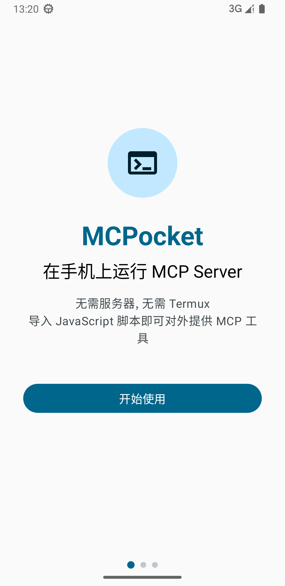 | 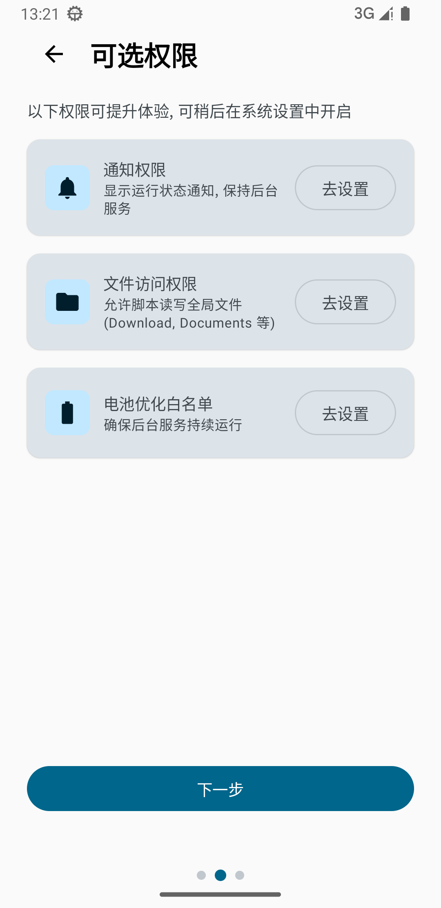 | 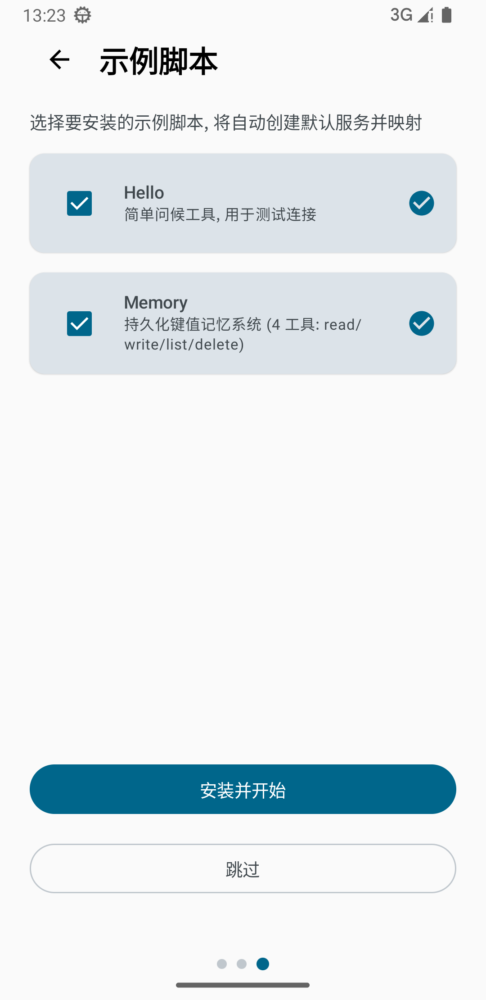 |

### 脚本管理

| 脚本列表 | 脚本详情 | 添加脚本 |
|:---:|:---:|:---:|
| 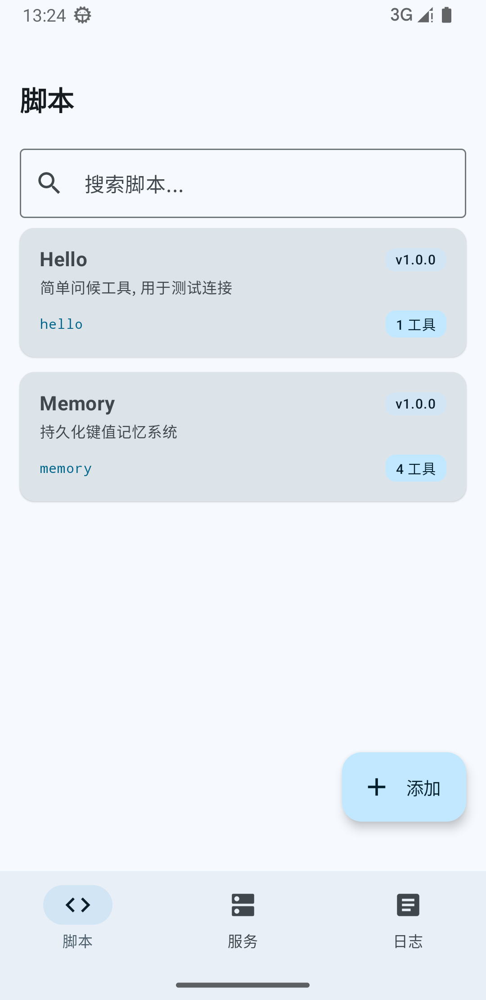 | 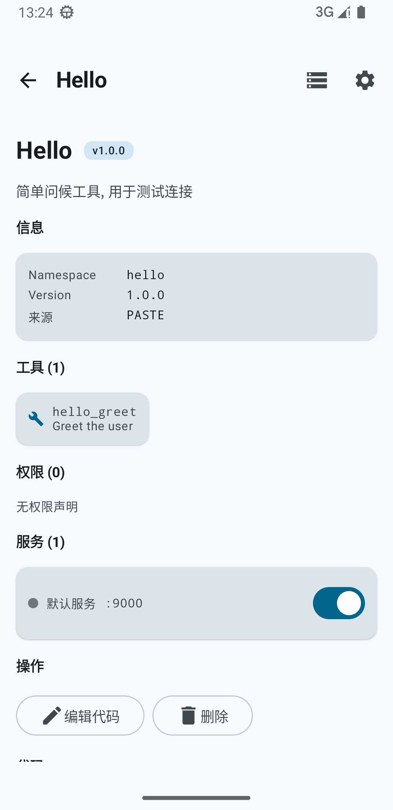 | 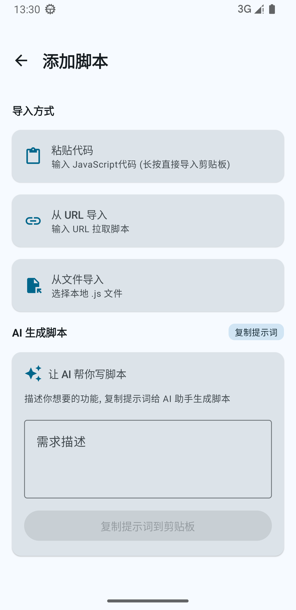 |

### 服务与连接

| 服务列表 | 服务详情 | 服务二维码 | 导出客户端配置 |
|:---:|:---:|:---:|:---:|
| 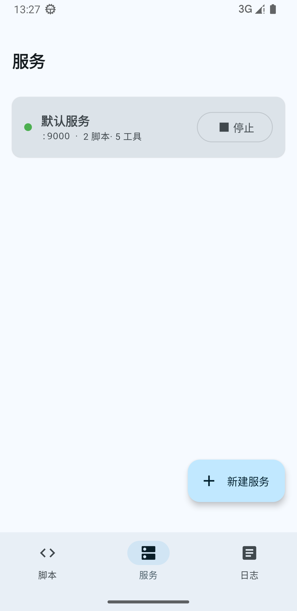 | 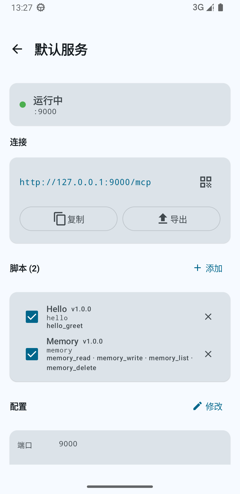 | 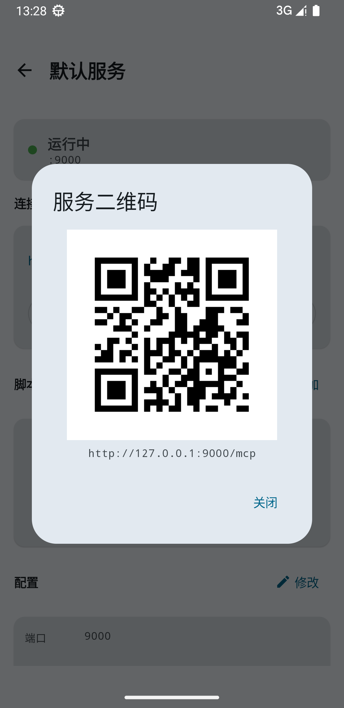 | 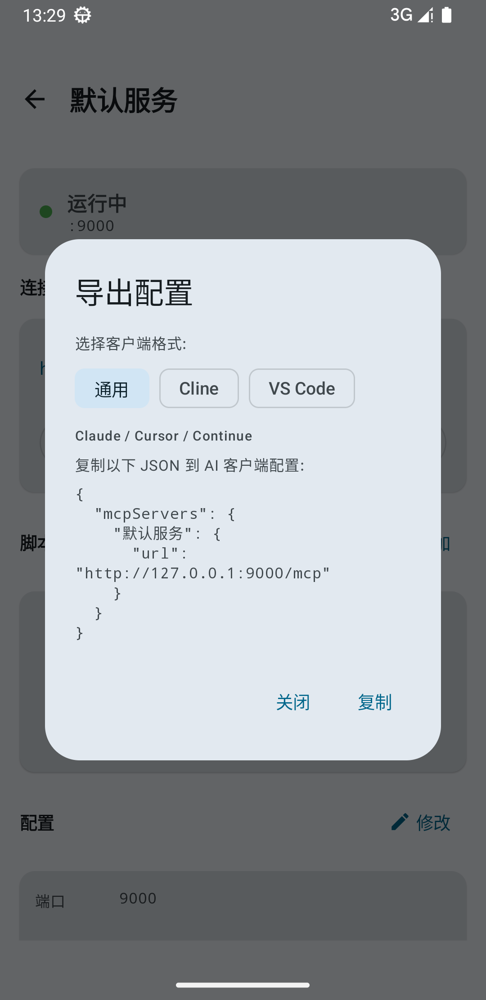 |

### 数据管理与日志

| 数据管理概览 | KV 存储 | SQL 数据库 | 日志 |
|:---:|:---:|:---:|:---:|
| 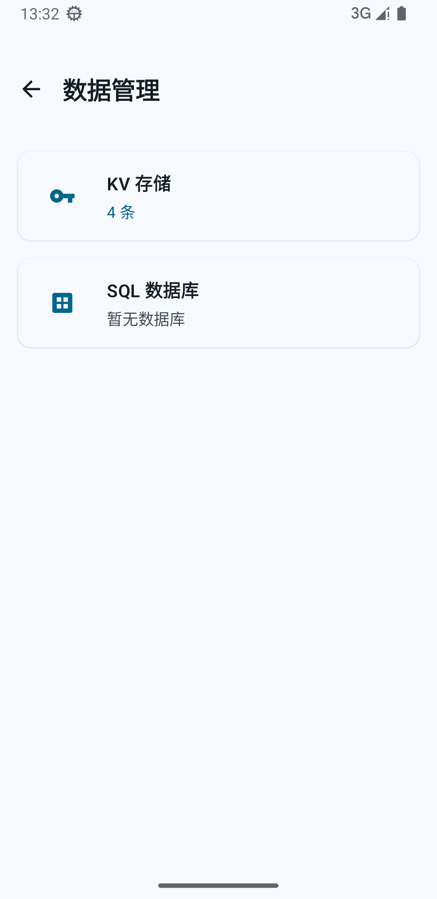 | 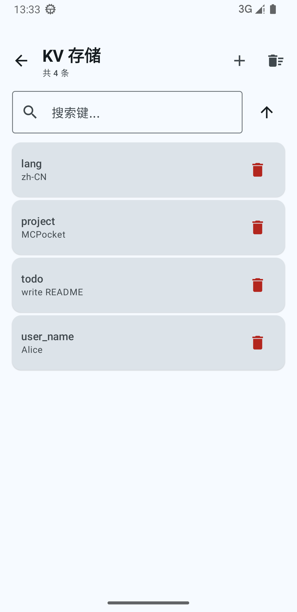 | 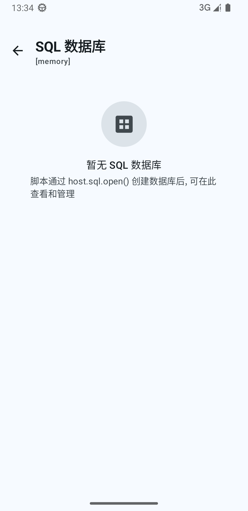 | 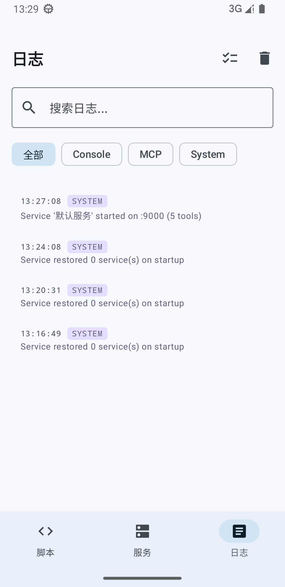 |

## 核心特性

- **纯本地运行**：MCP 服务运行在前台服务中，监听 `127.0.0.1`，所有数据不出手机。
- **QuickJS 脚本引擎**：导入 `.js` 脚本即可扩展能力，无需重新编译 App。支持从文件、URL、剪贴板导入，并提供「AI 生成脚本」辅助。
- **服务聚合**：一个服务（一个端口）可映射多个脚本，工具自动合并，AI 客户端只需连接一次。
- **权限模型**：脚本头部通过 `@permission` 声明所需能力（网络、剪贴板、文件、Toast 等），用户在 App 内逐项授权；KV / SQLite / 私有沙盒默认可用。
- **运行时数据浏览器**：App 内直接浏览和编辑脚本的 KV 存储与 SQLite 数据库（表数据、SQL 控制台），无需导出到外部工具。
- **一键连接 AI 客户端**：服务详情页提供二维码与配置导出，支持通用 / Cline / VS Code 三种格式。
- **i18n**：内置简中与英文，跟随系统语言。

## 工作原理

```
┌──────────────────────────────────────────────┐
│  AI 客户端 (Claude / Cursor / Cline ...)      │
│         │ Streamable HTTP (JSON-RPC)          │
│         ▼                                    │
│  http://127.0.0.1:<port>/mcp                  │
│         │                                    │
│  ┌──────┴───────┐   聚合多个脚本的工具         │
│  │  MCP Service │  (Service 层, Ktor SSE)     │
│  └──────┬───────┘                            │
│         │                                    │
│  ┌──────┴───────┐  ┌──────────┐  ┌────────┐ │
│  │  QuickJS 脚本 │  │ host.kv  │  │host.sql │ │
│  │  (namespace) │  │host.fs   │  │host.fetch│ │
│  │  mcp.tool()  │  │host.system│  │  ...    │ │
│  └──────────────┘  └──────────┘  └────────┘ │
│         │                                    │
│  scripts/<ns>/{kv,fs,sqlite}  数据隔离    │
└──────────────────────────────────────────────┘
```

每个脚本拥有唯一的 `namespace`，其运行时数据统一存放在 `scripts/<namespace>/` 下，包含 `kv/`（KV 存储）、`fs/`（文件沙盒）、`sqlite/`（数据库）三个子目录，彼此完全隔离。

## 快速开始

### 环境要求

- Android 8.0 (API 26) 及以上
- 支持 ARM64 / x86_64 架构

### 使用流程

1. **安装并完成引导**：首次启动会引导你授予通知、文件访问、电池白名单等可选权限，并可一键安装 Hello / Memory 示例脚本（会自动创建默认服务并映射）。
2. **导入脚本**：在「脚本」页点右下角 `+`，选择粘贴代码 / 从 URL 导入 / 从文件导入；也可使用「AI 生成脚本」描述需求，复制提示词交给 AI 生成后粘贴回来。
3. **创建服务**：在「服务」页点 `+ 新建服务`，命名并指定端口（可留空自动分配）。
4. **映射脚本到服务**：进入服务详情，在「脚本」区点 `+ 添加`，勾选要挂载的脚本。
5. **启动服务**：服务卡片或详情页点击「启动」，服务开始监听本地端口。
6. **连接 AI 客户端**：在服务详情点二维码图标扫码，或点「导出」复制对应格式的 JSON 配置到 AI 客户端。

## 脚本开发

脚本是一段 JavaScript，头部以注释声明元数据，主体调用全局 `mcp.tool()` 注册工具，并通过注入的 `host.*` API 访问系统能力。

> 应用内置生成脚本的Prompt生成器，可直接复制到 AI 客户端生成脚本，通常不需要手写。

### 头部元数据

```js
// @name Hello
// @namespace hello
// @version 1.0.0
// @description 简单问候工具, 用于测试连接
// @instructions 使用说明, 会被包含在 MCP server 的 instructions 中
```

### 注册工具

```js
mcp.tool("greet", "Greet the user", {
  type: "object",
  properties: { name: { type: "string", description: "Name to greet" } }
}, async (args) => {
  return { content: [{ type: "text", text: "Hello, " + (args.name || "World") + "!" }] };
});
```

### host API

App 向脚本注入全局 `host` 对象，提供以下能力（分层授权）：

| API | 说明 | 授权方式 |
|-----|------|---------|
| `host.kv` | 键值存储（get/set/list/delete） | 自动授予，namespace 隔离 |
| `host.sql` | SQLite 数据库（open/exec/query/transaction/drop） | 自动授予，namespace 隔离 |
| `host.fs.private` / `host.fs.external` | 私有沙盒 / AndroidData 目录读写 | 自动授予，沙箱隔离 |
| `host.fs.shared` | 共享存储（Download、Documents 等） | 需声明 `@permission`，用户授权 |
| `host.fetch` | HTTP 网络请求 | 需声明 `@permission host.fetch` |
| `host.system.clipboard` | 剪贴板读写 | 需声明 `@permission host.clipboard` |
| `host.system.deviceInfo` | 设备信息 | 需声明 `@permission host.deviceInfo` |
| `host.system.toast` | Toast 提示 | 需声明 `@permission host.toast` |
| `host.system.openUrl` | 打开 URL / Intent | 需声明 `@permission host.openUrl` |
| `console` / `timer` / `crypto` | 控制台 / 定时器 / 加密 | 自动授予（第 0 层） |

### 权限声明

在脚本头部注释中声明所需权限，导入后用户在脚本详情页逐项授权：

```js
// @permission host.fetch
// @permission host.fs.shared.read:~/Download/**
// @permission host.fs.shared.write:~/Documents/*
```

- `**` 表示递归匹配子目录，`*` 仅匹配单层
- `write` 隐含 `read`

### 完整示例：持久化记忆

```js
// @name Memory
// @namespace memory
// @version 1.0.0
// @description 持久化键值记忆系统
// @instructions 使用 memory.read 读取记忆, memory.write 写入记忆。

mcp.tool("read", "Read a memory by key", {
  type: "object",
  properties: { key: { type: "string" } },
  required: ["key"]
}, async (args) => {
  const value = await host.kv.get(args.key);
  return { content: [{ type: "text", text: value ?? "(empty)" }] };
});

mcp.tool("write", "Write a memory", {
  type: "object",
  properties: { key: { type: "string" }, value: { type: "string" } },
  required: ["key", "value"]
}, async (args) => {
  await host.kv.set(args.key, args.value);
  return { content: [{ type: "text", text: "saved" }] };
});
```

## 与 AI 客户端连接

服务详情页的「导出」按钮提供三种格式的 JSON 配置：

- **通用**：`{ "mcpServers": { "服务名": { "url": "..." } } }`，适用于 Claude / Cursor / Continue 等。
- **Cline**：`type: streamableHttp` 格式。
- **VS Code**：以 `servers` 为根键的格式。

也可点二维码图标，用 AI 客户端的扫码功能直接导入。

## 构建

```bash
.\gradlew.bat assembleDebug
```

产物位于 `app/build/outputs/apk/debug/`。

## 技术栈

- **Kotlin + Jetpack Compose**：UI 与业务层
- **MCP Kotlin SDK** (`io.modelcontextprotocol:kotlin-sdk-server`)：Streamable HTTP transport
- **Ktor CIO / SSE**：本地 HTTP 服务
- **QuickJS** (`dokar3:quickjs-kt-android`)：JS 脚本运行时
- **Room**：日志持久化
- **Material 3**：UI 组件